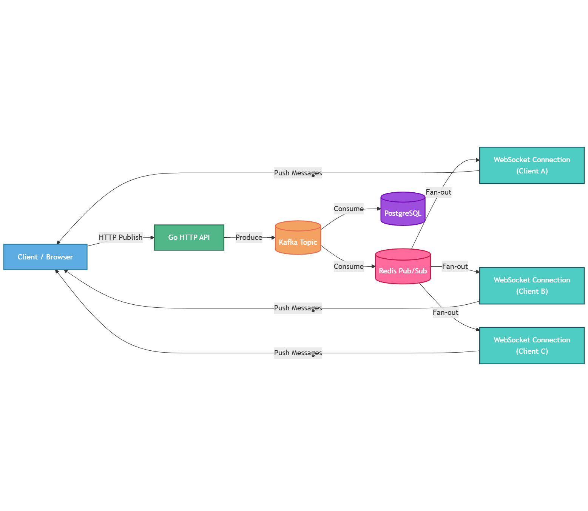

## Distributed Global Real-Time Chat System

A fault-tolerant, horizontally scalable real-time chat platform built using Golang,
Kafka, Redis, PostgreSQL, WebSockets, and Next.js. Designed around an event-driven
architecture to support thousands of concurrent users and high message throughput
with low latency.

## Architecture Overview

The system follows an event-driven, distributed architecture.

- API Gateway (Go HTTP server):
  Handles authentication, message publishing, and WebSocket upgrades.
- Kafka:
  Acts as the durable message backbone and decouples producers and consumers.
- Redis:
  Used as a low-latency fan-out layer for real-time message delivery.
- PostgreSQL:
  Serves as the source of truth for message persistence and user data.
- WebSocket Layer:
  Pushes messages to connected clients in real time.
- Next.js:
  Client-side rendering and real-time UI updates.

## Design Decisions

- Kafka was chosen to ensure durability and replayability of messages.
- Redis is used instead of Kafka consumers directly pushing to WebSockets
  to minimize latency and isolate real-time delivery failures.
- HTTP is used for publish to keep the producer side stateless and scalable.
- WebSockets are used only for subscriptions to maintain persistent delivery channels.
- Database writes happen asynchronously to avoid blocking real-time delivery.

## Fault Tolerance

- Kafka ensures messages are not lost even if consumers crash.
- Redis failures do not affect message persistence.
- WebSocket disconnects do not affect message storage.
- Consumer groups allow horizontal scaling and failover.
- At-least-once delivery semantics are maintained.

## Scalability

- Stateless Go servers allow horizontal scaling.
- Kafka partitions enable parallel message consumption.
- Redis Pub/Sub supports fast fan-out to multiple servers.
- WebSocket connections are distributed across server instances.

## Security

- TLS-encrypted connections for Kafka and PostgreSQL (Aiven-managed).
- Secure credential management using environment variables.
- JWT-based authentication for users.
- WebSocket connections authenticated during handshake.

## Message flow (data path)

HTTP publish
→ Kafka producer
→ Kafka topic
→ (parallel)
     → Kafka → DB
     → Kafka → Redis
→ Redis → server
→ server → WebSocket clients    

## Deployment Notes

# Kafka, Redis, and PostgreSQL are managed using Aiven
# Services are accessed securely over TLS
# Project is a monorepo managed with Yarn workspaces
# Environment Configuration
# All sensitive credentials and TLS materials are now stored entirely in environment variables.
# No certificate or key files (.pem, .cert, .key) are committed or required locally.

## Running the monorepo
1) go to apps/server
2) run go mod tidy
3) go mod download
4) go to root dir and run npm install
5) run "yarn run dev"  in the root dir to start the monorepo

